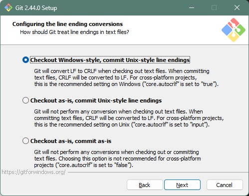
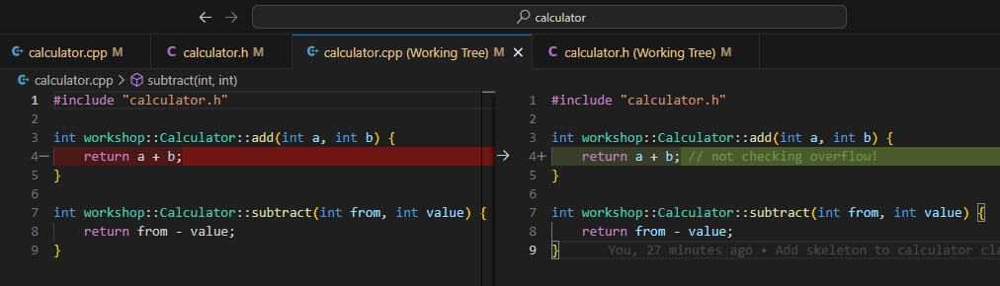

# Survival Git (Part One): Working On Our Own

This document contains material of the first part of the workshop that 
introduces [Git](https://git-scm.com/) for managing source codes.

## Table of Content

- [1. Installing Git](#1-installing-git)
    - [1.1 MacOS](#11-macos)
    - [1.2 Windows](#12-windows)
    - [1.3 Installing Visual Studio Code and Extension](#13-installing-visual-studio-code-and-extension)
- [2. Creating a Git Repository](#2-creating-a-git-repository)
- [3. The First Commit](#3-the-first-commit)
    - [3.1 Staging Changes](#31-staging-changes)
    - [3.2 Committing Changes](#32-committing-changes)
- [4. Adding Files](#4-adding-files)
- [5. Modifying Files](#5-modifying-files)
- [6. Moving Files](#6-moving-files)
- [7. Deleting Files](#7-deleting-files)
- [8. Common Command Line Usage](#8-common-command-line-usage)
- [9. Reverting Changes](#9-reverting-changes)
- [10. Tagging a Version](#10-tagging-a-version)
- [Summary](#summary)

## 1. Installing Git

### 1.1 MacOS

Git is available by installing XCode command line tools. Open a `Terminal`
window, and type

```
git --version
```

If XCode command line tools is not yet installed, it will prompt you to
download and install. Upon successful installation, the above command will
display the current git version on the system.

### 1.2 Windows

Git is available by installing Git for Windows at 
[https://gitforwindows.org/index.html](https://gitforwindows.org/index.html).
Download the latest version there.

If you have `Windows Terminal` installed, it is helpful to add a Git Bash
profile to it:


You may accept the default options. In particular, on Windows, you should 
choose the option *Checkout Windows-style, commit Unix-style line endings* for
line ending conversions:



Finally, after installation completes, we are going to set the default display
name and email to be used in future git operations. Open a terminal window and
type

```
git config --global user.name "Claudio Fu"
git config --global user.email "eeclaudio@ust.hk"
```

Replace the user name and email by yours. Now we are ready to create our first
repository!

### 1.3 Installing Visual Studio Code and Extension

We will work on a simple C++ project and will use Visual Studio Code as the 
editor. To simplify the setup of C++ development environment, we may use the 
resource provided by COMP2011 course:

- [VS Code Installation and Usage](https://course.cse.ust.hk/comp2011/labs/vscode/index.html)
  - You may follow the instruction from the section [Using the portable version for Windows (The easiest way)](https://course.cse.ust.hk/comp2011/labs/vscode/index.html#portable)

And to install a Git client inside Visual Studio Code, we will install the
extension [GitLens](https://marketplace.visualstudio.com/items?itemName=eamodio.gitlens) 
to Visual Studio Code.

## 2. Creating a Git Repository

In this workshop we will demonstrate Git usage using a simple C++ project. The
project creates a console program functioning as a simple calculator.

First of all, let's create the project directory from scratch. It will be 
called `calculator`. Open a terminal window, go to the directory you want to
store source codes, then type

```
mkdir calculator
cd calculator
```

We can then initialize the `calculator` directory as a Git repository:

```
git init .
```

Git tells us the initialization succeeded:

> Initialized empty Git repository in C:/Users/eeclaudio/Documents/Codes/calculator/.git/

Right now the `calculator` directory is the root directory of our new git
repository. Git will keep track of changes inside this directory. 
However, we may not want it to track every file, for example, the build output 
like object files, executables, etc. We can do this by supplying a `.gitignore`
file specifying the patterns of filenames which should be ignored.

Different project types and programming languages have their own files to be
ignored. People have gather useful templates of common `.gitnore` files in
[https://github.com/github/gitignore](https://github.com/github/gitignore). We
will use the C++ template. Download it and copy its content to the file 
`.gitignore` under the root directory.

## 3. The First Commit

Now let's create a main program, `main.cpp`, with the below content under the 
root directory.

```
#include <iostream>

using namespace std;

int main(int argc, char** argv) {
    cout << "Welcome to simple calculator!" << endl;
    return 0;
}
```

Go to the `Source Control` tab in Visual Studio Code, already git has detected
we have 2 untracked changes, which are new files `.gitignore` and `main.cpp`.


### 3.1 Staging Changes

Git uses a two-stage commit process: first we need to **stage** the desired
changes, then we **commit** the staged changes. This provides some 
flexibilities to selectively commit part of the pending changes (although this 
may not be a good practice).

We now stage the above two changes. Click the '+' sign next to a file to stage
it, or click the '+' sign next to the ```Changes``` header to stage all files.


### 3.2 Committing Changes

We are now ready for our first commit. A message must be supplied for every 
commit made. The message usually describes why the changes in the committed 
files occurred. To save yourself from headaches in the future understanding why
a particular change or edit occurred, you are recommended to write better
commit messages. 

Enter the commit message and click **Commit** button. Expand the **COMMITS** 
section and you can see our first commit is recorded with our commit message
and the set of changese(`A` stands for added - it means we add new files).


## 4. Adding Files

We continue to add two new source files, `calculator.h` and `calculator.cpp`:

`calculator.h`
```c++
#ifndef __CALCULATOR_H__
#define __CALCULATOR_H__

namespace workshop {

    class Calculator {
        public:
            int add(int a, int b);

            int subtract(int from, int value);
    };

}

#endif
```

`calculator.cpp`
```c++
#include "calculator.h"

int workshop::Calculator::add(int a, int b) {
    return a + b;
}

int workshop::Calculator::subtract(int from, int value) {
    return from - value;
}
```

Like previously, we stage all changes.


And commit them with a nice message.


Similarly we can see our new commit history.


## 5. Modifying Files

Next, we are going to make changes to the existing files. Modify the content
of `main.cpp` to add the header file:

```c++
#include "calculator.h"
```

And change the content of the main function to:

```c++
int main(int argc, char** argv) {
    cout << "Welcome to simple calculator!" << endl;
    
    int op1, op2;
    cout << "Please enter the first operand: ";
    cin >> op1;
    cout << "Please enter the second operand: ";
    cin >> op2;

    workshop::Calculator calc;
    cout << op1 << " + " << op2 << " = " << calc.add(op1, op2) << endl;
    cout << op1 << " - " << op2 << " = " << calc.subtract(op1, op2) << endl;

    return 0;
}
```

Notice that under the **Source Control** tab, next to `main.cpp` there is a `M`
indicating that the file has been modified.


Double clicking the file to see the side-by-side difference:


The above add new lines to a file. How about removing existing lines and 
modifying existing lines? 




Now let's commit all the above modifications and move on to the next section.

## 6. Moving Files

Once a file has been tracked by Git, Git will notice it has been moved to a 
different location. 

Let's try to create new directories `src` and `include`. Then we move both
`main.cpp` and `calculator.cpp` to `src`, and `calculator.h` to `include`.
After this relocation, we need to also update the include lines in `main.cpp`
and `calculator.cpp` to 

```
#include "../include/calculator.h"
```

Now take a look at what Git reports in the `Source Control` tab:


First of all, we see that Git does not track directories. That means merely
creating a new empty directory is not enough to let Git report for changes.
Next, we see that initially, Git breaks down the relocation into `D` and `U`
changes - a deletion, and an addition.

Now stage both the `D` and `U` changes of `calculator.cpp`:


Notice that Git now reports the relocation of `calculator.cpp` and marked it
as `R` (renamed). Double-clicking this change reveals a file diff, marking
the edit we made to the include line:


When we are not simply relocating files but with the addition of minor changes
to the file (like what we did so far), Git will mark it as `renamed` changes.
However, if the changes to the file are sufficiently large, Git will break the
changes into a `D` (deleted) and `U` (untracked, meaning addition of new file).

We now stage the remaining changes, and all of them should be recognized as 
`R` (renamed) operations.

## 7. Deleting Files

In the previous section, we briefly touched deleting files. We can delete a
file and Git will report it as `D` (deleted). Notice that Git only reports 
deletion of files already being tracked, i.e. those that have been added and
committed as changes. We won't it out here and it is left as an exercise 
to you.

## 8. Common Command Line Usage

Git is actually a command line tool. So far we have used the command line only
once during the creation of a repository. For simple operations, it may be more
convenient to use command line instead. The following are some simple Git 
commands:

- Staging a file:

    ```
    git add [file]
    ```

- Unstaging a file:

    ```
    git reset [file]
    ```

- Committing change:

    ```
    git commit -m "[description]"
    ```

- Showing modified file status:

    ```
    git status
    ```

## 9. Reverting Changes

What's the use of a version control system if we cannot go back to a previous
state? Suppose we don't like the changes brought about by the commit in 
section [Moving Files](#6-moving-files), let's see how we undo this change.

This time we will use the command line. To see the recent commit history, we
type:

```
git log
```


If you see a colon ':' at the end of the output, you may press space bar to go
to the next page. Finally you type `q` to exit the git history.

Every commit has an ID, or called *commit hash*, which is a SHA-1 checksum.
Here, we want to revert to the state before commit `a91aee33b4...`, we type:

```
git revert --no-commit a91aee33
```

Notice that we don't have to specify the full commit ID. Git will use the 
characters you type to do a prefix match, so you only need to make sure what 
you type is sufficient for Git to match a particular commit ID. Because it is
a checksum most probably we only need to type the first few characters and 
there is a very high chance that it uniquely identifies one.

Now see what Git responds. It staged the changes required to revert the commit
for us (those `R` changes), and pre-filled a good commit message. You may click
on each of the staged changes to verify the change in file content matches our
expectation.


We click the `Commit` button after checking everything is fine. And you can 
verify in the commit history graph or using `git log` command our revert is
successful.

## 10. Tagging a Version

Another great feature of a version control system is to mark a *version* to
a particular snapshot of source codes. Giving versions to snapshots enable us
to use a friendly name to identify the snapshots. For Git, when talking about
these snapshots we are actually referring to a particular commit, identifiable
via its commit hash.

Suppose we want to create a tag `v1.0.0` to the commit `a91aee33b`:

```
git tag -a v1.0.0 a91aee33b
```

This command will open the default text editor and let you enter a message.
Fill in something like "Created tag v1.0.0" will do. Save and exit the editor
and the tag will be created. We can verify by typing:

```
git tag
```


Later on, we can restore the snapshot identified by a tag using:

```
git checkout v1.0.0
```

Be careful, after issuing this command, you are in a so called 'detached HEAD'
state, meaning that the changes you make will no longer belongs to any Git
branch (more on this later). To switch back to the latest source codes, we 
issue the command:

```
git checkout main
```

`main` is the name of the default branch of a Git repository. Traditionally,
`master` is the name of the default branch, but recently people begin to change
to `main` as it is more descriptive and inclusive.

## Summary

So far, we have learnt how to use Git in the most basic form:
- creating a source code repository
- adding, modifying, relocating and deleting source files
- reverting changes
- creating and switching to tags

We haven't touched how Git is used cooperatively between multiple developers.
That will be the focus of the next part.