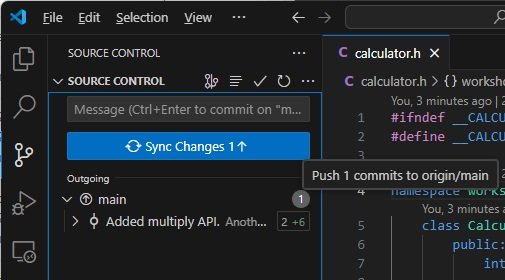

# Survival Git (Part 2): Working With Remote

This document contains material of the second part of the workshop that 
introduces [Git](https://git-scm.com/) for managing source codes. In this part
we will focus on collaborating with our peers to work on the same source tree.

## Table of Content

- [1. GitHub](#1-github)
  - [1.1 Creating a SSH Key](#11-creating-a-ssh-key)
  - [1.2 Creating a GitHub Repository](#12-creating-a-github-repository)
- [2. Simulating Our Peer](#2-simulating-our-peer)
- [3. Cloning the Repository](#3-cloning-the-repository)
- [4. Pushing Changes (By Peer)](#4-pushing-changes-by-peer)
- [5. Fetching & Pulling Changes (By Me)](#5-fetching--pulling-changes-by-me)
- [6. Handling Conflicts](#6-handling-conflicts)
  - [6.1 Making More Edits (By Peer)](#61-making-more-edits-by-peer)
  - [6.2 Making More Edits (By Me)](#62-making-more-edits-by-me)
  - [6.3 Getting & Resolving Conflicts (By Me)](#63-getting--resolving-conflicts-by-me)
  - [6.4 Getting Latest Repository Changes (By Peer)](#64-getting-latest-repository-changes-by-peer)
- [7. Branches](#7-branches)
  - [7.1 Creating and Working on a Local Branch (By Me)](#71-creating-and-working-on-a-local-branch-by-me)
  - [7.2 More Edits on Default Branch (By Peer)](#72-more-edits-on-default-branch-by-peer)
  - [7.3 Fetching Latest Commits (By Me)](#73-fetching-latest-commits-by-me)
- [Summary](#summary)
- [Further Readings](#further-readings)


## 1. GitHub

[GitHub](https://github.com/) is the most popular cloud Git repository hosting
service. Apart from storing your repository, it offers various tools to 
faciliate software development, such as bug tracking, test automation and 
continuous delivery systems. 

In this workshop, we are using GitHub to host our Git repository. Once a GitHub
repository is set up, we can allow other people to collaborate with us on the
same code base.

First of all, please sign up with GitHub.com using your personal or UST email.

### 1.1 Creating a SSH Key

We will use SSH to transfer files between our machine and GitHub. To use SSH,
we have to create a SSH key pair for our machine and upload the public key to
GitHub.

First, [check](https://docs.github.com/en/authentication/connecting-to-github-with-ssh/checking-for-existing-ssh-keys#checking-for-existing-ssh-keys)
whether you have already craeted a SSH key pair. 

If not, [create one](https://docs.github.com/en/authentication/connecting-to-github-with-ssh/generating-a-new-ssh-key-and-adding-it-to-the-ssh-agent#generating-a-new-ssh-key).

And finally, [add](https://docs.github.com/en/authentication/connecting-to-github-with-ssh/adding-a-new-ssh-key-to-your-github-account#adding-a-new-ssh-key-to-your-account)
it to your GitHub account.

### 1.2 Creating a GitHub Repository

Next, we can create a new repository by visiting [https://github.com/new](https://github.com/new).
For this workshop, we are simulating our peers, so a *private* repository will
do. And for example, we may choose `calculator` as the name of the repository.

Now, we can *push* our repository which we have been using to GitHub:

```
git remote add origin git@github.com:claudiofsm/calculator.git
git push --all -u origin
```

Don't forget to replace the URL with your own. We are now ready for others to
collaborate on this `calculator` repository.

## 2. Simulating Our Peer

Git allows us to collaborate with others on the same source code repository. 

The common workflow of collaborating on a repository is as follows:
- Clone the repository
- Make changes
- Pull latest changes, resolving conflicts if necessary
- Push all changes 
- Make changes again and repeat the cycle 

In this workshop, we will simulate our peer by cloning a separate copy of the
repository to our machine. In real life, your peers will clone the repository 
to their machines.

## 3. Cloning the Repository

To work on an existing repository, we start by *cloning* the repository to our 
machine. This is true for all the collaborators of the project. Let's use the
command line to do this quickly.

First of all, look up the clone URL from GitHub:


Go to `Downloads` directory. Copy that into our command line:

```
git clone <your-clone-URL>
```

Wait for the cloning to complete. We can rename the cloned directory to any
name we want. To distinguish it, rename it to `calculator-peer`. Moreover, we 
can edit the user name to make it more obvious we are simulating a peer. Go to 
the `calculator-peer` directory and type:

```
git config user.name "Another Claudio"
git config user.email "eeclaudio@ust.hk"
```

Replace the user name and email to yours. From now on, we refer to this cloned
repository the *peer repository*, to distinguish it from *my repository* which
we have been using.

## 4. Pushing Changes (By Peer)

Let's simulate our peer making edits. For example, we are going to add the 
`multiply` operation:


As usual, we commit our changes:

```
git add calculator.h calculator.cpp
git commit -m "Added multiply API."
```

Whenever we want to let our peers aware of the changes we made, after 
committing our changes *locally*, we need to "push* our changes to the remote
repository (i.e. GitHub). We can do this by clicking the *Sync Changes* button:



If you mouse over the button before clicking it, it states that we are 
"pushing 1 commits to origin/main", exactly what we want.

## 5. Fetching & Pulling Changes (By Me)

Back to our own repository. Before doing anything, let's confirm the status of
our own local copy. Verify that from the `Commits` section we are not seeing 
anything new:


If we click the little fetch icon, we do a *fetch*, i.e. read the latest
changes from the repository, but do not mix the changes with our local copy
yet. After fetching changes, notice that it reports there is an *incoming*
change by our peer.


In this case it is safe to actually mix the changes with our local copy. We do
this by *pulling* from the *remote*. Let's click the `Sync Changes` button. 
Now open the files `calculator.h` and `calculator.cpp` and you should see the 
`multiply` method being added. We successfully got the changes by our peer!

## 6. Handling Conflicts

It is unlikely that we and our peer works serially, waiting for each other's 
pushes before doing our own edits. The beauty of a version control system is 
that it allows concurrent edits and resolving conflicts.

### 6.1 Making More Edits (By Peer)

Go to peer repository, and modify the content of `calculator.cpp`:

```c++
#include <iostream>

int workshop::Calculator::multiply(int a, int b) {
    int result = a * b;
    std::cout << "Called multiply(" << a << "," << b << ") returns " << result;
    return result;
}
```

Now commit and push the change:

```
git add calculator.cpp
git commit -m "Added debug prints."
git push origin main
```

### 6.2 Making More Edits (By Me)

Go to my repository, but **DO NOT** fetch and pull from remote. Rename the 
parameters of `multiply` method to `op1` and `op2` in both `calculator.h` and
`calculator.cpp`:

```c++
// calculator.h
int multiply(int op1, int op2);

// calculator.cpp
int workshop::Calculator::multiply(int op1, int op2) {
    return op1 * op2;
}
```

Now commit the change:

```
git add calcualtor.h calculator.cpp
git commit -m "Renamed method parameters."
```

### 6.3 Getting & Resolving Conflicts (By Me)

What we have done was that both we and our peer edit the same source file
`calculator.cpp` *and* change the same lines. This is the so called conflicting
edits. Let's see how Git reports that to us.

Go to my repository, and try to click `Sync Changes` button:


Git detects that there is a conflict and requires us to *resolve* the conflicts
before pushing our changes. Double-clicking the conflicting file 
`calculator.cpp`, we see how Git presents the conflicting parts to us.

We see our edits are below the `<<<<<` arrow line, and above the separator 
`====` line (named *Current Change*), while the edits our peer made are below 
the `====` line and above the `>>>>>` arrow line (named *Incoming Change*). We
need to edit the file to remove those arrow lines and separator line, because
right now the file is erratic and gives compilation errors!

By default, we are giving some options by Visual Studio Code to make the edit:
- Accept Current Change: that means replacing the conflicting area by our 
edits, completely discarding the peer's edits.
- Accepting Incoming Change: that means replacing the conflicting area by the 
peer's edits, completely discarding our own edits.
- Accept Both Changes: that means replacing the conflicting area by both ours
and the peer's edits, i.e. retain all the content by simply removing the arrow
and separator lines.

Of course, which option to use is judged by the person who is resolving the 
conflicts on a case-by-case basis. In this example, to retain the semantics of 
both edits, none of the above default options is useful. We need to make our 
edits manually:

```c++
int workshop::Calculator::multiply(int op1, int op2) {
    int result = op1 * op2;
    std::cout << "Called multiply(" << op1 << "," << op2 << ") returns " << result;
    return result;
}
```

After resolving the conflicts in `calculator.cpp`, we stage that file, and make
a new commit:

```
git add calculator.cpp
git commit
```

This time we don't specify a commit message because Git has a default one which
looks better:


Save the file in the editor (by pressing a colon followed by an x). Now the 
conflict has been resolved on our side only; we need to push it so that our 
peers can receive this change:

```
git push origin main
```

### 6.4 Getting Latest Repository Changes (By Peer)

Go to peer repository, and we can *pull* the latest changes:

```
git pull
```

You can verify that there are two new commits, one is the change we made, the
other being the conflict resolution:


## 7. Branches

An important concept in any version control system is **branches**. You can
treat a branch as a parallel universe - when you are working on a branch, the 
changes you make do not affect other branches.

Whenever a Git repository is created, there is a default branch. In fact, we 
are working on this default branch all along. Historically, this default branch
is called ```master```, but more recently people start to use ```main``` or 
```dev``` as these names are more politically neutral.

A branch can be *local* or *remote*:

- a *local* branch exists on the repository of your local machine
- a *remote* branch exists on the repository of your remote peer

A local branch can *track* a remote branch, meaning that the changes in the 
branch are synchronized among local and remote peer.

A branch may be created for:

- implementing a software feature
- creating software releases
- experimenting changes without affecting normal codes

### 7.1 Creating and Working on a Local Branch (By Me)

Let's create a branch to implement the division feature of our calculator. We will do this in *my repository*. In a terminal, type

```
git checkout -b division
```

We see that git responded that a new branched is created and we have switched
to it:


Now we implement the division feature:

- Add the method ```divide(int, int)``` to ```calculator``` class

  - Add this line to ```calculator.h```:

    ```c++ 
    int divide(int dividend, int divisor);
    ```

  - And these lines to ```calculator.cpp```:

    ```c++
    int workshop::Calculator::divide(int dividend, int divisor) {
        return dividend / divisor;
    }
    ```

- Update the main program to use the new method

  - Add this line to ```main.cpp```:

    ```c++
    cout << op1 << " / " << op2 << " = " << calc.divide(op1, op2) << endl;
    ```

As usual, we can stage and commit the changes.

### 7.2 More Edits on Default Branch (By Peer)

There is nothing to prevent your peer to continue to work on the default branch
while you are working on a local branch. We will see how these branches are 
independent from each other. 

Now, in peer repository, we continue to make edits:

- Add the method ```modulo(int, int)``` to ```calculator``` class
  
  - In ```calculator.h```, add the line
  
    ```c++
    int modulo(int op1, int op2);
    ```

  - In ```calculator.cpp```, add the lines
    
    ```c++
    int workshop::Calculator::modulo(int op1, int op2) {
        return op1 % op2;
    }
    ```

- Updated the main program to use the new method

  - In ```main.cpp```, add the line
    
    ```c++
    cout << op1 << " % " << op2 << " = " << calc.modulo(op1, op2) << endl;
    ```

And we commit and push the changes to remote.

### 7.3 Fetching Latest Commits (By Me)

Because we have completed the implementation of the division operation on our
local branch, it is ready to be *merged* to the default branch and pushed to
our peers. Before that, we need to pull from the remote for the latest
changes (if any, in our case there is).

In the terminal, change back to main branch:

```
git checkout main
```

Then pull from remote:

```
git pull
```

We see that Git has pulled the latest changes from the remote:


Now, we try to merge our changes in the branch ```division``` into the branch
```main```:

```
git merge division
```


Oops! Git reports there are conflicts! That's expected, our peers have edited 
the same files as we did. And this is very common when the time between you
started working on a local branch and pulling the latest change is long enough.

Don't panic, we will fix the conflict in Visual Studio Code. Because we want to
retain both the edits we and our peer made, we choose ```Accept both changes```
to resolve the conflict.

Then, under the ```Merge Changes``` section, we click the '+' button next to 
each modified file to stage them, marking the conflcts resolved.


And we see there is a prefilled commit message, we simply click commit. Finally
we click ```Sync Changes``` to publish our changes to remote peer. We have 
completed a workflow of creating a local branch to implement a feature!

As an exercise, you may try a ```git pull``` in peer repository to confirm all
the changes (i.e. the ```divide()``` and ```modulo``` methods) are properly 
published.

## Summary

In this part of the workshop, we have learnt:
- using cloud repository hosting service, e.g. GitHub, to store our source codes
  and share with our peers
- fixing conflicting edits from our peers
- using branches to isolate independent work
- working on a clone-edit-pull-push development loop

## Further Readings

We have only scratched the surface of Git. To learn more, you may find the
following links useful:

- [Pro Git Book](https://git-scm.com/book/en/v2)
- [A Survival Guide to Git](https://terjesandstrom.github.io/ASurvivalGuideToGit)
- [Learn Git Fundamentals](https://www.freecodecamp.org/news/learn-git-basics/)
